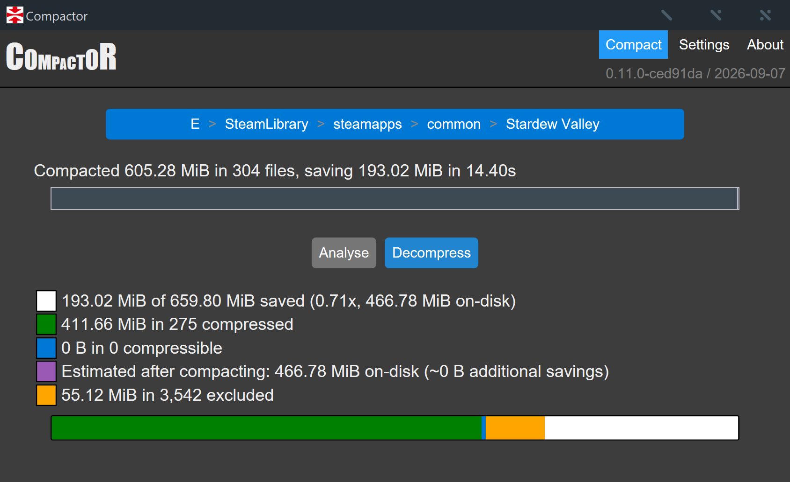

# Compactor

Compactor is a small Windows GUI for applying Windows Overlay Filter (WOF) filesystem compression to folders.

This repository is a maintained fork of [Freaky/Compactor](https://github.com/Freaky/Compactor). It retains the original Rust GUI and WOF-based compression model while fixing known issues and improving analysis and maintenance.



## Features

- XPRESS4K, XPRESS8K, XPRESS16K, and LZX compression
- LZX as the default compression mode
- Sampled compressibility analysis before compression
- Configurable minimum estimated savings threshold, defaulting to 1%
- Estimated post-compression size and additional savings during analysis
- Storage-aware multithreaded analysis and compression on SSDs
- Conservative physical-core-aware LZX concurrency
- Single-threaded HDD operation by default
- HDD analysis sampling designed to reduce seek overhead
- Compression workers run below normal priority so the desktop remains responsive
- The system is kept awake during compression/decompression while the display may still turn off
- Local-NTFS target validation and protection for Windows-managed paths
- DirectStorage runtime detection with a warning before compression
- In-app searchable viewer for folders containing WOF-compressed files
- Pause, resume, and stop controls
- Timestamp preservation after compression and decompression
- Automatic retry of previously incompressible files after they change
- Case-insensitive exclusion patterns with blank-entry filtering
- Safe handling of encrypted, sparse, offline, reparse-point, and NTFS-compressed files
- No default file-extension exclusions

## Defaults

- Compression: `LZX`
- Minimum estimated savings: `1%`
- Maximum threads: `Auto`
- HDDs only use 1 thread: enabled
- Excluded paths:
  - `*:\\Windows*`
  - `*:\\System Volume Information*`
  - `*:\\$*`

`Auto` is storage- and workload-aware. On SSDs it uses up to eight workers for analysis. XPRESS compression can use up to 16 logical-CPU workers, while LZX is deliberately limited to one worker on CPUs with four or fewer physical cores and at most two workers on larger CPUs because each LZX operation is already internally multithreaded. HDDs use one worker by default to avoid seek thrashing, and unknown storage is handled conservatively with one worker. A manual limit from 1 to 16 can be set in Settings; the LZX safety cap still applies. Compression reuses a valid analysis estimate when the file has not changed, avoiding duplicate sampling before WOF compression.

File extensions are not used to decide whether a file should be compressed. Eligible files are sampled and compared against the configured savings threshold.

## Installation

Download the latest Windows x64 executable from the [Releases](https://github.com/wefalltomorrow/Compactor/releases) page.

Compactor is portable and does not require an installer or background service.

## Usage

1. Choose a folder.
2. Wait for analysis to complete.
3. Review current disk usage and estimated savings.
4. Change the compression mode, savings threshold, or thread limit in Settings if required.
5. Select Compress.

Use Decompress to remove WOF backing from files previously compressed with Compactor. After analysis, select View beside the compressed count to browse folders containing WOF-compressed files inside Compactor. The viewer includes path filtering and pagination for large scans.

## Notes

Compactor is best suited to applications and game files that change infrequently. Modifying a WOF-compressed file causes Windows to materialise it again, so updated folders may need to be analysed and compressed again.

Compression and decompression hold each active file against concurrent writers and deleters while still allowing readers. This reduces the risk of racing an application or game update in the middle of a WOF operation. Files that change between analysis and compression are re-estimated instead of reusing stale analysis results.

If a selected folder contains `dstorage.dll` or `dstoragecore.dll`, Compactor warns that DirectStorage is present. WOF compression can prevent DirectStorage/BypassIO from taking its intended fast path, so consider leaving DirectStorage games uncompressed when I/O performance matters.

Do not run Compactor blindly across an entire system drive. Whole-drive roots, network/UNC targets, non-NTFS filesystems, the active Windows directory, `System Volume Information`, root `$*` directories, and the root `Recovery` directory are rejected. User-selected folders can still contain databases, virtual machines, active logs, or other write-heavy files that are poor candidates for WOF compression.

Compactor does not elevate itself through UAC. Protected files may require running the program with appropriate permissions.

Keep backups of important data. The software is provided without warranty under the MIT License.

## Changes from upstream v0.10.1

This fork includes the following changes:

- Correct Win32 `BOOL` handling for WOF `DeviceIoControl` calls
- Correct handling of `ERROR_COMPRESSION_NOT_BENEFICIAL`
- Required read-data/write-attributes access for WOF operations
- File handles that block concurrent writers/deleters during active WOF operations
- Case-insensitive exclusions and blank-entry filtering
- Explicit skipping of encrypted, sparse, offline, reparse-point, and NTFS-compressed files
- Incompressible-cache keys based on path, file size, and modification time
- Zero-safe progress calculations and saturating size arithmetic
- Byte-aware compression progress
- Configurable savings thresholds
- Estimated post-compression size and savings in the GUI
- Actual NTFS cluster-size-aware eligibility and projected allocation
- LZX as the default compression mode with a conservative one-or-two-worker outer concurrency cap
- Below-normal compression worker priority
- System-sleep prevention during compression/decompression without forcing the display awake
- Stronger local-NTFS and Windows-managed-path target validation
- DirectStorage runtime warning
- Removal of default file-extension exclusions
- Storage-aware worker selection and parallel SSD processing
- Reduced-seek HDD analysis sampling
- Lower scan memory usage for large excluded trees and bounded parallel estimation batches
- More accurate post-decompression on-disk accounting
- In-app compressed-folder viewer with filtering and pagination
- Windows x64 CI on stable Rust

See [CHANGELOG.md](CHANGELOG.md) for the full change history.

## Building

Requirements:

- Windows 10 or Windows 11
- Stable Rust with the `x86_64-pc-windows-msvc` toolchain
- Microsoft C++ build tools required by the Rust MSVC toolchain

Build with:

```powershell
cargo build --release
```

The executable is written to:

```text
target\\release\\Compactor.exe
```

## Technical details

Compactor is primarily written in [Rust](https://www.rust-lang.org/) and uses a local embedded web-view for the GUI. It does not require remote web resources at runtime.

WOF compression is applied through [`FSCTL_SET_EXTERNAL_BACKING`](https://learn.microsoft.com/windows-hardware/drivers/ifs/fsctl-set-external-backing) and removed through [`FSCTL_DELETE_EXTERNAL_BACKING`](https://learn.microsoft.com/windows-hardware/drivers/ifs/fsctl-delete-external-backing).

Compressibility sampling uses Thomas Hurst's [compresstimator](https://github.com/Freaky/compresstimator) project. SSD analysis uses distributed sampling, while HDD analysis uses a small number of contiguous sample windows to reduce seek overhead. Estimates are sampling results and are not exact predictions of final WOF size; the displayed projection is also adjusted for the selected WOF algorithm and rounded to the target volume's NTFS cluster size.

Windows storage-property queries are used to distinguish storage with and without seek penalties. If storage type cannot be determined, Compactor uses one worker thread. Windows processor-topology information is used only to choose the conservative LZX outer-worker cap.

## Credits

Compactor was originally written by [Thomas Hurst (Freaky)](https://github.com/Freaky). This fork retains the original MIT-licensed work and attribution.

See [LICENSE.txt](LICENSE.txt) for license terms.
